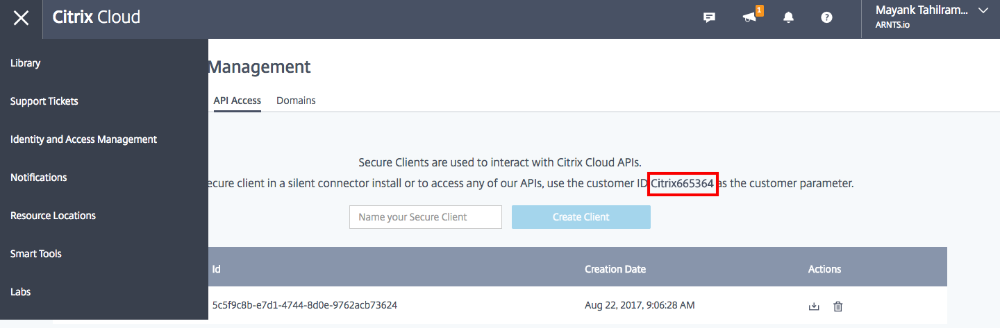

# Docker [Smart Tools](https://www.citrix.com/blogs/2017/01/10/get-your-xenapp-xendesktop-environments-in-top-shape-with-citrix-smart-tools/) Agent

[Smart Tools](https://www.citrix.com/products/smart-tools/) is a cloud based services that allows you to automate and deploy scripts to target hosts that have local light weight agents that connect to the cloud control plane over port 443. The solution has many more features, but for the sake of this repository, we will be focusing on the **Build** and **Deploy** capability within Smart Tools. 

A containerized agent allows for executing code or collection of code (Blueprints) dynamically across compute environments within containers. Combine provisioning of containers with a container orchestrator or deploy to IoT devices and you can dynamically create isolated run time environments for Blueprints deployed by Smart Tools.

This project serves as an experiment to fully leverage the potential of Smart Tools ability to deploy scripts and workflows for automation purposes with a DevOps workflow. Next steps will be to further develop workflows and other tools to build a Citrix driven [IaC](https://en.wikipedia.org/wiki/Infrastructure_as_Code) solution. 

# Instructions

### Pre-Requisites:

  1. Have Docker installed locally or on your host to run a containerized version of the Smart Tools agent. 
  
  2. Create a [citrix.cloud.com](https://citrix.cloud.com) account. Subscribe to the free Smart Tools service to access [smart.cloud.com](https://smart.cloud.com)

  3. Obtain your Smart Tools **API Key** and **API Secret** along with your **Company ID**. 
    * Navigate to *Resources & Settings* > *My Profile* to obtain your API credentials.
    
      

    * Navigate to Citrix Cloud's **Identiy and Access Management** (IAM) pane then navigate to **API Access* to retrieve your Citrix Cloud Company ID. 

      

  4. You will use the information from above to update key values in [secrets.json](./data/secrets.json)

### Create a Smart Tool's Docker Image 

  1. Enter the following code to clone this repository locally:

    ```git clone https://github.com/MayankTahil/docker-smart-tools.git```

  2. Navigate to the `docker-smart-tools` directory and update the values in the `secrets.json` with your API Key/Secret and Company ID. 

  3. Execute the following docker commands to build your image in the `docker-smart-tools` directory: 

    ```docker build -t smart-tools .```

### Run a Smart Tools Docker Container 

  Enter the following docker commands to run your docker container and see it show up registered under your managed servers. 
    
  `docker run -dt --name=agent1 smart-tools .`

  >You can execute other docker parameters needed defined in the docker run command or in a docker-compose.yaml file. To learn more about docker and how to run containers, refer to [this tutorial](https://github.com/Citrix-TechSpecialist/Docker-101). This tutorial will shed light on managing any persistent data, port mapping, and more. 

  
